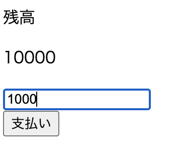
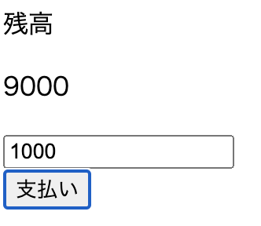
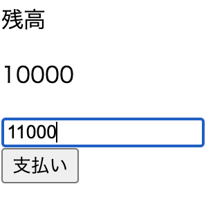
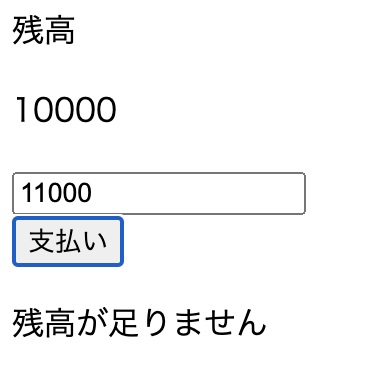

## 課題1

### 下記を見て、要件を満たすページを実装してください。

* `2-advance`フォルダの中のHTMLファイル、CSSファイル、JavaScriptファイルを使用してください。
* 上記ファイルは自由に変更を加えてください。
* すでに「残高」「10000」というテキスト、inputのフォーム、ボタンが`index.html`に用意されています。
* フォームに数字を入力して、ボタンを押すと、10000からその数字を引いた数が表示されるようにしてください。

↓

* もし10000より多い数字が入力された場合は、「残高が足りません」とテキストを表示してください。

↓

 

---

## 課題2

### 課題1で実装したコードを言語化してください。

* `2-advance`フォルダの中に`ABOUT_CODE`という名前のマークダウンファイルを置いてください。
* 課題1で実装したコードを他の人に説明することを仮定して、簡潔に実装した内容を言語化して記述してください。